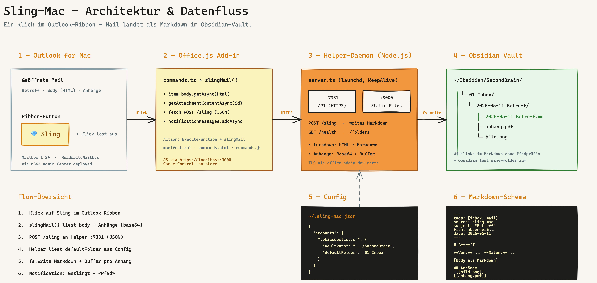

# Sling-Mac

Persoenliches Office.js Add-in fuer Outlook auf macOS, das geoeffnete Mails inklusive Anhaengen per Klick als Markdown in einen Obsidian-Vault schreibt.

## Was es macht

Ein Klick im Outlook-Ribbon ("Sling") nimmt die aktuell geoeffnete Mail, holt Body und Anhaenge, schreibt eine Markdown-Datei nach `01 Inbox/YYYY-MM-DD Betreff/` im konfigurierten Vault und legt die Anhaenge in denselben Ordner. Wikilinks zu den Anhaengen werden automatisch in die Markdown-Datei eingebettet (Bilder als `![[…]]`-Embed, andere Dateien als `[[…]]`-Link). Der Vorgang ist bewusst manuell, es gibt kein Auto-Sling.

Vorlage war SlingMD (Windows-VSTO). Sling-Mac ist drastisch reduziert auf den Mac-Use-Case: nur Mail-Read-Surface, nur Slingen.

## Architektur



Editierbare Excalidraw-Quelle: [`docs/architecture.excalidraw`](docs/architecture.excalidraw).

Drei Komponenten:

| Komponente | Aufgabe |
|---|---|
| **Office.js Add-in** (`add-in/`) | XML-Manifest plus `commands.ts`. Wird in Outlook for Mac geladen, liefert den Sling-Button im Message-Read-Ribbon. |
| **Node.js Helper-Daemon** (`helper/`) | Zwei HTTPS-Server auf `https://localhost:7331` (API, nimmt Sling-Requests entgegen) und `https://localhost:3000` (Static Files, liefert `commands.html`, `taskpane.html`, Icons an Outlook). Laeuft persistent ueber launchd. |
| **Obsidian Vault** | Ziel-Verzeichnis im Dateisystem. Wird vom Helper direkt beschrieben. |

Beide Server nutzen das gleiche TLS-Zertifikat aus `~/.office-addin-dev-certs/` (von `office-addin-dev-certs install` erzeugt), damit Outlook die Endpunkte als trusted akzeptiert.

## Datenfluss

1. Nutzer klickt im Ribbon einer geoeffneten Mail auf **Sling**.
2. Outlook ruft die Funktion `slingMail` aus `commands.ts` auf (registriert via `globalThis["slingMail"]`).
3. `slingMail` holt Betreff, `from`, `to`, Body (`body.getAsync` als HTML) sowie alle nicht-inline File-Anhaenge (`getAttachmentContentAsync`, Base64).
4. Payload wird per `POST https://localhost:7331/sling` an den Helper geschickt.
5. Der Helper konvertiert das HTML mit Turndown nach Markdown, baut die Frontmatter, legt den Ziel-Ordner an, schreibt die Markdown-Datei und alle Anhaenge.
6. Helper antwortet mit `{ path, attachments }`. Add-in zeigt eine Outlook-Notification mit dem Pfad an.

## Installation / Setup

### Voraussetzungen

- macOS
- Node.js 22+ (siehe launchd-Plist: `/opt/homebrew/opt/node@22/bin/node`)
- Outlook for Mac
- Microsoft-365-Account mit Berechtigung, Add-ins zu sideloaden (oder ein eigenes Tenant Admin Center)
- Ein lokal vorhandener Obsidian-Vault

### Repo klonen und bauen

```bash
git clone <repo-url> ~/Documents/GitHub/sling-mac
cd ~/Documents/GitHub/sling-mac

cd helper
npm install
npm run build

cd ../add-in
npm install
npm run build
```

### TLS-Zertifikate installieren

```bash
cd add-in
npx office-addin-dev-certs install
```

Das erzeugt `~/.office-addin-dev-certs/localhost.crt` und `localhost.key`. Beide werden vom Helper-Server gelesen und sind im macOS-Keychain als trusted hinterlegt.

### Helper als launchd-Daemon einrichten

```bash
cp launchd/ch.owlist.sling-mac-helper.plist ~/Library/LaunchAgents/
launchctl load ~/Library/LaunchAgents/ch.owlist.sling-mac-helper.plist
```

Logs liegen unter `/tmp/sling-mac-helper.log` und `/tmp/sling-mac-helper.error.log`.

### Konfiguration anlegen

`~/.sling-mac.json` mit mindestens einem Account-Block (siehe naechster Abschnitt).

### Manifest sideloaden

`add-in/manifest.xml` ueber das M365 Admin Center hochladen oder via "Integrierte Apps" / "Eigenes Add-In hinzufuegen" in Outlook for Mac sideloaden.

## Konfiguration

Die Helper-Konfiguration lebt in `~/.sling-mac.json`:

```json
{
  "accounts": {
    "deine-mail@example.com": {
      "vaultPath": "/Users/deinuser/Obsidian/SecondBrain",
      "defaultFolder": "01 Inbox"
    }
  }
}
```

| Feld | Bedeutung |
|---|---|
| `accounts` | Map: E-Mail-Adresse → Account-Konfiguration. Die Adresse wird vom Add-in via `Office.context.mailbox.userProfile.emailAddress` mitgeschickt. |
| `vaultPath` | Absoluter Pfad zum Obsidian-Vault-Root. |
| `defaultFolder` | Zielordner relativ zum Vault. Alle geslingten Mails landen unter `<vaultPath>/<defaultFolder>/<YYYY-MM-DD Betreff>/`. |

Multi-Account: pro E-Mail-Adresse ein eigener Block mit eigenem Vault und Default-Ordner. Wird beim Slingen keine passende Adresse gefunden, faellt der Helper auf den ersten Account in der Map zurueck (siehe `getAccountConfig` in `helper/src/config.ts`).

## Nutzung

1. Eine Mail in Outlook for Mac oeffnen.
2. Im Ribbon auf **Sling** klicken.
3. Outlook zeigt eine Info-Notification mit dem geschriebenen Pfad an. Bei Anhaengen wird die Anzahl mit angezeigt. Fehler erscheinen als Error-Notification.

## Ordnerstruktur im Vault

Pro geslingter Mail wird ein eigener Ordner angelegt:

```
01 Inbox/
└── 2026-05-11 Betreff der Mail/
    ├── 2026-05-11 Betreff der Mail.md
    ├── anhang1.pdf
    └── bild.png
```

Wikilinks im Markdown referenzieren die Anhaenge ohne Pfadpraefix, da sie im selben Ordner liegen. Bilder werden als Obsidian-Embed (`![[…]]`) eingebunden, andere Dateien als normaler Wikilink (`[[…]]`).

Der Dateiname wird aus Datum plus bereinigtem Betreff gebaut (alles ausser Buchstaben, Ziffern, deutschen Umlauten, Bindestrich und Leerzeichen wird entfernt, auf 80 Zeichen gekuerzt).

## Markdown-Schema

```markdown
---
tags: [inbox, mail]
source: sling-mac
subject: "Betreff der Mail"
from: absender@example.com
date: 2026-05-11
---

# Betreff der Mail

**Von:** Absender Name <absender@example.com>
**An:** Empfaenger Name <empfaenger@example.com>
**Datum:** 2026-05-11

---

<Body als Markdown, konvertiert mit Turndown>

## Anhaenge

![[bild.png]]
[[anhang1.pdf]]
```

Der `## Anhaenge`-Block wird nur angehaengt, wenn Anhaenge gespeichert wurden.

## Bekannte Einschraenkungen / Scope-Reduktion

- **Kein Vault-Ordner-Picker beim Slingen.** Wurde sowohl als Dialog-WebView als auch als TaskPane versucht. Der Dialog-Weg wird durch die Outlook-Mac-Sandbox blockiert (Cross-Origin-Probleme trotz Same-Origin-Workaround auf Port 3000). Der TaskPane-Weg scheitert in der Praxis am aggressiven Manifest-Caching im M365 Admin Center pro Add-in-ID. Workaround: Default-Ordner in `~/.sling-mac.json` setzen und in Obsidian nachsortieren. Die Picker-Endpunkte (`/folders`, `/set-pending-folder`, `/get-pending-folder`) und `picker.html` / `taskpane.html` sind im Repo, aber nicht aktiv im Manifest-Pfad eingebunden.
- **Nur Mail-Read-Surface.** Das Manifest haengt am `MessageReadCommandSurface`. Kein Compose-Support, kein Slingen aus dem Editor heraus.
- **Anhaenge** werden via `getAttachmentContentAsync` geholt. Funktioniert mit der hier deklarierten `ReadWriteMailbox`-Permission, ist aber auf den `AttachmentType.File` und nicht-inline Anhaenge beschraenkt.
- **Conversation-Threading** wird zwar im Payload mitgeschickt (`conversationId`), aktuell aber nicht zur Gruppierung verwendet. Jede Mail bekommt einen eigenen Ordner.

## Technische Erkenntnisse

Notizen aus dem Bauen, falls jemand (oder ich selbst spaeter) das Setup nachbauen will:

- **Webpack `scriptLoading: "blocking"` ist Pflicht** fuer Office.js Function Files. Mit dem Default `defer` wird `slingMail` nicht rechtzeitig registriert und Outlook meldet die Funktion als unbekannt.
- **`makeEwsRequestAsync` braucht `ReadWriteMailbox`.** Das M365 Admin Center verankert diese Permission unzuverlaessig — nach Manifest-Updates oft erst, wenn die Add-in-ID neu vergeben wird.
- **`getCallbackTokenAsync({isRest: true})` schlaegt ohne Azure-AD-App-Registration fehl.** Fuer dieses Setup nicht gebraucht, da der Body via `body.getAsync` und Anhaenge via `getAttachmentContentAsync` geholt werden — keine direkten Graph-/EWS-Calls aus dem Add-in.
- **Static Server liefert `Cache-Control: no-store`.** Sonst werden `commands.js` und `taskpane.html` von Outlook hartnaeckig gecached, was Debugging unangenehm macht.
- **Zwei Ports sind kein Zufall.** Port 3000 (Static) und Port 7331 (API) sind beide HTTPS mit dem gleichen Dev-Cert. Port 3000 dient als Same-Origin fuer Manifest-referenzierte HTML-/JS-Files; Port 7331 ist die eigentliche API.
- **Die Picker-Endpunkte sind absichtlich auf beiden Ports gemountet,** falls man den TaskPane-Weg spaeter doch reaktiviert (`pickerRouter` wird in `server.ts` zweimal verwendet).

## Repo-Struktur

```
sling-mac/
├── add-in/                                # Office.js Add-in (TypeScript, Webpack)
│   ├── src/
│   │   ├── commands/
│   │   │   ├── commands.ts                # slingMail-Funktion (aktiv)
│   │   │   └── commands.html              # Function-File-Wrapper
│   │   ├── taskpane/
│   │   │   ├── taskpane.ts                # nicht aktiv im Manifest-Pfad
│   │   │   └── taskpane.html              # nicht aktiv
│   │   └── picker.html                    # nicht aktiv (Dialog-Variante)
│   ├── assets/                            # Icon-Set (16/32/64/80/128)
│   ├── manifest.xml                       # Office-Add-in-Manifest
│   ├── webpack.config.js
│   ├── tsconfig.json
│   └── package.json
├── helper/                                # Node.js HTTPS-Helper-Server
│   ├── src/
│   │   ├── server.ts                      # Express, Turndown, beide Ports
│   │   └── config.ts                      # ~/.sling-mac.json-Loader
│   ├── scripts/setup.ts                   # interaktives Anlegen von ~/.sling-mac.json
│   ├── tsconfig.json
│   └── package.json
├── launchd/
│   ├── ch.owlist.sling-mac-helper.plist   # Helper-Daemon
│   └── ch.owlist.sling-mac-addin.plist
└── README.md
```

## Verwandte Projekte

- **Teams-Obsidian-Bridge** — Schwesterprojekt, separates Repo. Buy-First-Ansatz fuer Teams-Inhalte (existierende Tools evaluieren statt von Grund auf bauen).

## Lizenz / Status

Persoenliches Tool. Privates Repo. Kein Public Release geplant. Keine Versionierung, keine Garantien, keine Support-Verpflichtung.
