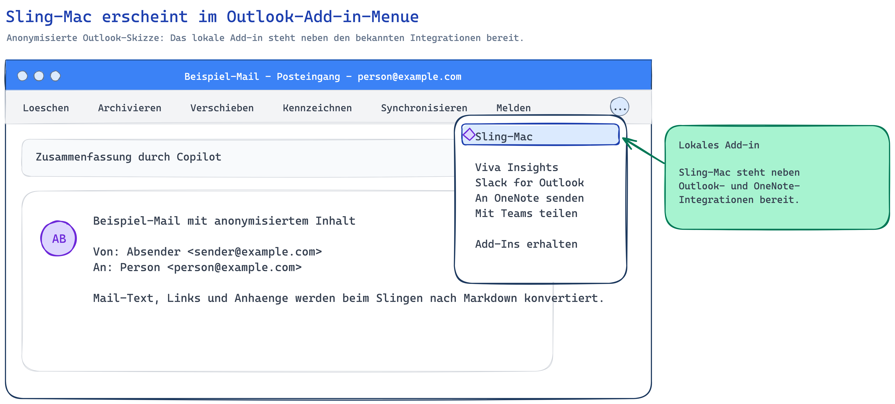
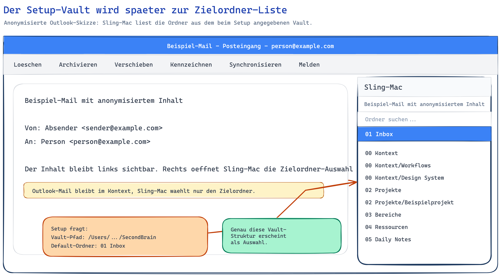

# Sling-Mac

Persoenliches Office.js Add-in fuer Outlook auf macOS, das geoeffnete Mails inklusive Anhaengen per Klick als Markdown in einen Obsidian-Vault schreibt. Beim Setup wird pro Outlook-Account ein Vault plus Standard-Zielordner konfiguriert; dorthin landet jede geslingte Mail.

## Was es macht

Ein Klick im Outlook-Ribbon ("Sling") nimmt die aktuell geoeffnete Mail, holt Body und Anhaenge, schreibt eine Markdown-Datei in den konfigurierten Obsidian-Vault und legt die Anhaenge in denselben Ordner. Die Mail landet immer unter dem im Setup definierten Default-Ordner, z.B. `01 Inbox/YYYY-MM-DD Betreff/`. Wikilinks zu den Anhaengen werden automatisch in die Markdown-Datei eingebettet (Bilder als `![[…]]`-Embed, andere Dateien als `[[…]]`-Link). Der Vorgang ist bewusst manuell, es gibt kein Auto-Sling.

> [!NOTE]
> **Zielordner-Auswahl beim Slingen ist derzeit nicht aktiv.** Der Ribbon-Button ist eine `ExecuteFunction`, die direkt in den Default-Ordner slingt. Eine vollstaendige Picker-Oberflaeche (suchbare Vault-Ordnerliste, `taskpane.ts` + Helper-Endpunkt `/folders`) liegt im Code vor, ist aber nicht ins Manifest verdrahtet — es gibt keinen `ShowTaskpane`-Button, der sie oeffnet (der `ShowTaskpane`-Weg scheiterte am aggressiven Outlook-Mac-Caching, siehe „Bekannte Einschraenkungen"). Sortierung in andere Ordner passiert aktuell in Obsidian nach dem Slingen.

Vorlage war SlingMD (Windows-VSTO). Sling-Mac ist drastisch reduziert auf den Mac-Use-Case: nur Mail-Read-Surface, nur Slingen.

## Architektur


Editierbare Excalidraw-Quelle: [`docs/architecture.excalidraw`](docs/architecture.excalidraw).

Drei Komponenten:

| Komponente | Aufgabe |
|---|---|
| **Office.js Add-in** (`add-in/`) | XML-Manifest plus `commands.ts`. Wird in Outlook for Mac geladen, liefert den Sling-Button im Message-Read-Ribbon. |
| **Node.js Helper-Daemon** (`helper/`) | Zwei HTTPS-Server auf `https://localhost:7331` (API, nimmt Sling-Requests entgegen) und `https://localhost:3000` (Static Files, liefert `commands.html`, `taskpane.html`, Icons an Outlook). Laeuft persistent ueber launchd. |
| **Obsidian Vault** | Ziel-Verzeichnis im Dateisystem. Wird vom Helper direkt beschrieben. |

Beide Server nutzen das gleiche TLS-Zertifikat aus `~/.office-addin-dev-certs/` (von `office-addin-dev-certs install` erzeugt), damit Outlook die Endpunkte als trusted akzeptiert.

## Datenfluss

1. Nutzer klickt im Ribbon einer geoeffneten Mail auf **Sling**.
2. Outlook ruft die Funktion `slingMail` aus `commands.ts` auf (registriert via `globalThis["slingMail"]`).
3. `slingMail` holt Betreff, `from`, `to`, Body (`body.getAsync` als HTML) sowie alle nicht-inline File-Anhaenge (`getAttachmentContentAsync`, Base64).
4. Payload wird per `POST https://localhost:7331/sling` an den Helper geschickt.
5. Der Helper konvertiert das HTML mit Turndown nach Markdown, baut die Frontmatter, legt den Ziel-Ordner an, schreibt die Markdown-Datei und alle Anhaenge.
6. Helper antwortet mit `{ path, attachments }`. Add-in zeigt eine Outlook-Notification mit dem Pfad an.

## Installation / Setup

> [!WARNING]
> **Nicht in einen iCloud-synchronisierten Ordner klonen** (`~/Documents`, `~/Desktop` bei aktiviertem "Schreibtisch & Dokumente"-Sync, oder iCloud Drive direkt).
>
> iCloud lagert bei "Mac-Speicher optimieren" einzelne Dateien als Platzhalter aus. Trifft Nodes synchroner Datei-Read (`express.static` im Helper bzw. `require()` beim Laden) auf so eine ausgelagerte Datei, gibt macOS **errno -11 (EDEADLK)** zurueck statt sie rechtzeitig zu materialisieren. Folge: der Static-Server liefert `commands.js` als **HTTP 500**, der Sling-Button laedt seinen Handler nicht, und das Add-in wirkt kaputt — intermittierend und schwer zu diagnostizieren.
>
> Empfohlen: ein nicht-synchronisiertes Verzeichnis wie `~/Developer/sling-mac`. Alle Pfade unten und in `launchd/ch.owlist.sling-mac-helper.plist` gehen von `~/Developer/sling-mac` aus — beim Verschieben eines bestehenden Setups die Plist-Pfade entsprechend anpassen und den Daemon neu laden.

### Voraussetzungen

- macOS
- Node.js 22+ (siehe launchd-Plist: `/opt/homebrew/opt/node@22/bin/node`)
- Outlook for Mac
- Microsoft-365-Account mit Berechtigung, Add-ins zu sideloaden (oder ein eigenes Tenant Admin Center)
- Ein lokal vorhandener Obsidian-Vault

### Repo klonen und bauen

```bash
git clone <repo-url> ~/Developer/sling-mac   # NICHT nach ~/Documents (iCloud) — siehe Warnung oben
cd ~/Developer/sling-mac

cd helper
npm install
npm run build

cd ../add-in
npm install
npm run build
```

### TLS-Zertifikate installieren

```bash
cd add-in
npx office-addin-dev-certs install
```

Das erzeugt `~/.office-addin-dev-certs/localhost.crt` und `localhost.key`. Beide werden vom Helper-Server gelesen und sind im macOS-Keychain als trusted hinterlegt.

### Helper als launchd-Daemon einrichten

```bash
cp launchd/ch.owlist.sling-mac-helper.plist ~/Library/LaunchAgents/
launchctl load ~/Library/LaunchAgents/ch.owlist.sling-mac-helper.plist
```

Logs liegen unter `/tmp/sling-mac-helper.log` und `/tmp/sling-mac-helper.error.log`.

### Konfiguration per Setup anlegen

Das Helper-Setup fragt interaktiv nach der Outlook-E-Mail-Adresse, dem Vault-Pfad und dem Standard-Zielordner innerhalb des Vaults:

```bash
cd helper
npm run setup
```

Beispiel-Dialog:

```text
Sling-Mac Setup

Outlook E-Mail-Adresse: deine-mail@example.com
Vault-Pfad [/Users/deinuser/Obsidian]: /Users/deinuser/Obsidian/SecondBrain
Standard-Sling-Ordner (relativ zum Vault) [01 Inbox]: 01 Inbox
```

Das Setup schreibt diese Angaben nach `~/.sling-mac.json`. Der `vaultPath` ist der Schreibort fuer geslingte Mails. (Er ist ausserdem die Quelle fuer die Ordnerliste der noch nicht aktiven Picker-Oberflaeche — siehe Hinweis ganz oben.)

### Manifest sideloaden

`add-in/manifest.xml` ueber das M365 Admin Center hochladen oder via "Integrierte Apps" / "Eigenes Add-In hinzufuegen" in Outlook for Mac sideloaden.

## Konfiguration

Die Helper-Konfiguration lebt in `~/.sling-mac.json`:

```json
{
  "accounts": {
    "deine-mail@example.com": {
      "vaultPath": "/Users/deinuser/Obsidian/SecondBrain",
      "defaultFolder": "01 Inbox"
    }
  }
}
```

| Feld | Bedeutung |
|---|---|
| `accounts` | Map: E-Mail-Adresse → Account-Konfiguration. Die Adresse wird vom Add-in via `Office.context.mailbox.userProfile.emailAddress` mitgeschickt. |
| `vaultPath` | Absoluter Pfad zum Obsidian-Vault-Root. (Aus diesem Vault liest der Helper auch die Ordner fuer die noch nicht aktive Picker-Oberflaeche.) |
| `defaultFolder` | Zielordner relativ zum Vault. **Jede** geslingte Mail landet unter `<vaultPath>/<defaultFolder>/<YYYY-MM-DD Betreff>/` — beim Slingen gibt es derzeit keine Ordner-Auswahl. |

Multi-Account: pro E-Mail-Adresse ein eigener Block mit eigenem Vault und Default-Ordner. Wird beim Slingen keine passende Adresse gefunden, faellt der Helper auf den ersten Account in der Map zurueck (siehe `getAccountConfig` in `helper/src/config.ts`).

## Nutzung

### Schnelles Slingen in den Default-Ordner

1. Eine Mail in Outlook for Mac oeffnen.
2. Im Ribbon auf **Sling** klicken.
3. Outlook schreibt die Mail in den im Setup definierten Default-Ordner und zeigt eine Info-Notification mit dem geschriebenen Pfad an. Bei Anhaengen wird die Anzahl mit angezeigt. Fehler erscheinen als Error-Notification.

### Zielordner ueber die Sling-Mac-Oberflaeche waehlen (implementiert, derzeit nicht aktiv)

> [!NOTE]
> Dieser Abschnitt beschreibt eine **im Code vorhandene, aber nicht ins Manifest verdrahtete** Funktion. Aktuell slingt der Button immer in den Default-Ordner (siehe Hinweis ganz oben). Die folgende Beschreibung gilt erst, wenn der Picker via `ShowTaskpane` aktiviert wird.

Die Picker-Oberflaeche (`add-in/src/taskpane/taskpane.ts`) wuerde rechts in Outlook die aktuell geoeffnete Mail und darunter eine suchbare Ordnerliste zeigen. Diese Liste kommt aus dem Vault, der beim Setup als `vaultPath` gespeichert wurde (Helper-Endpunkt `/folders`). Sichtbar waeren die obersten Vault-Ordner und deren direkte Unterordner, z.B.:

```text
00 Kontext
00 Kontext/Workflows
01 Inbox
02 Projekte
02 Projekte/CAS Vibe Engineering
04 Ressourcen
```

Der im Setup definierte `defaultFolder` ist vorausgewaehlt. Wer einen anderen Zielordner anklickt und dann **Sling** ausloest, wuerde die Mail in diesen Ordner schreiben (`taskpane.ts` sendet `targetFolder`). Warum es derzeit nicht aktiv ist: siehe „Bekannte Einschraenkungen".

### Skizzen fuer das Handbuch

Die anonymisierten Excalidraw-Skizzen zeigen die beiden relevanten Outlook-Momente (die zweite zeigt die geplante, noch nicht aktive Picker-Oberflaeche):



Editierbare Excalidraw-Quelle: [`docs/sling-mac-outlook-menu.excalidraw`](docs/sling-mac-outlook-menu.excalidraw).



Editierbare Excalidraw-Quelle: [`docs/sling-mac-folder-picker.excalidraw`](docs/sling-mac-folder-picker.excalidraw).

## Ordnerstruktur im Vault

Pro geslingter Mail wird ein eigener Ordner angelegt:

```
01 Inbox/
└── 2026-05-11 Betreff der Mail/
    ├── 2026-05-11 Betreff der Mail.md
    ├── anhang1.pdf
    └── bild.png
```

Wikilinks im Markdown referenzieren die Anhaenge ohne Pfadpraefix, da sie im selben Ordner liegen. Bilder werden als Obsidian-Embed (`![[…]]`) eingebunden, andere Dateien als normaler Wikilink (`[[…]]`).

Der Dateiname wird aus Datum plus bereinigtem Betreff gebaut (alles ausser Buchstaben, Ziffern, deutschen Umlauten, Bindestrich und Leerzeichen wird entfernt, auf 80 Zeichen gekuerzt).

## Markdown-Schema

```markdown
---
tags: [inbox, mail]
source: sling-mac
subject: "Betreff der Mail"
from: absender@example.com
date: 2026-05-11
---

# Betreff der Mail

**Von:** Absender Name <absender@example.com>
**An:** Empfaenger Name <empfaenger@example.com>
**Datum:** 2026-05-11

---

<Body als Markdown, konvertiert mit Turndown>

## Anhaenge

![[bild.png]]
[[anhang1.pdf]]
```

Der `## Anhaenge`-Block wird nur angehaengt, wenn Anhaenge gespeichert wurden.

## Troubleshooting

Bekannte Fehlerbilder mit Diagnose- und Fix-Befehlen: siehe [`docs/TROUBLESHOOTING.md`](docs/TROUBLESHOOTING.md) und die Schnell-Übersicht in [`docs/KNOWN_ISSUES.md`](docs/KNOWN_ISSUES.md).

Schnell-Check, wenn das Add-in nicht funktioniert:

```bash
launchctl list | grep -i sling                          # Daemon lebt?
lsof -nP -iTCP:7331 -sTCP:LISTEN                        # Port 7331 IPv4 + IPv6?
curl -k -I https://127.0.0.1:7331/health                # Erreichbar via IPv4?
curl -k -I https://127.0.0.1:3000/taskpane.html         # Static-Server via IPv4?
```

Wenn der Daemon nur an `[::1]` lauscht oder IPv4-curl Connection refused liefert: auf v0.1.3+ updaten (Dual-Stack-Fix).

## Bekannte Einschraenkungen / Scope-Reduktion

- **Ordner-Picker ist nicht aktiv (toter Code).** Helper-Endpunkt `/folders` und die Picker-UI `taskpane.ts` sind vollstaendig implementiert, aber das Manifest exponiert nur einen `ExecuteFunction`-Button (`slingMail`), der `targetFolder: ""` hardcodiert — also immer den Default-Ordner nimmt. Es gibt keinen `ShowTaskpane`-Button, der die Oberflaeche oeffnet. Grund: Der `ShowTaskpane`-Weg liess sich auf Outlook for Mac nicht stabil ausliefern (siehe naechster Punkt). Reaktivierung = `ShowTaskpane`-Control ins Manifest + neue Add-in-ID.
- **Outlook-Mac-Caching bleibt zaeh.** Nach Manifest-Aenderungen behaelt Outlook bzw. das M365 Admin Center alte Add-in-Metadaten hartnaeckig — bei der `ShowTaskpane`-Umstellung lief sogar nach Remove+Re-Add und neuer GUID die alte `ExecuteFunction` weiter (genau deshalb wurde der Picker descoped). Hilft in der Praxis: neue Add-in-ID bzw. erneutes Sideloading.
- **Ordner-Picker waere bewusst flach.** Der Helper liest nur die erste und zweite Ordnerebene des Vaults (`/folders`), damit die Liste schnell und uebersichtlich bliebe.
- **Nur Mail-Read-Surface.** Das Manifest haengt am `MessageReadCommandSurface`. Kein Compose-Support, kein Slingen aus dem Editor heraus.
- **Anhaenge** werden via `getAttachmentContentAsync` geholt. Funktioniert mit der hier deklarierten `ReadWriteMailbox`-Permission, ist aber auf den `AttachmentType.File` und nicht-inline Anhaenge beschraenkt.
- **Conversation-Threading** wird zwar im Payload mitgeschickt (`conversationId`), aktuell aber nicht zur Gruppierung verwendet. Jede Mail bekommt einen eigenen Ordner.

## Technische Erkenntnisse

Notizen aus dem Bauen, falls jemand (oder ich selbst spaeter) das Setup nachbauen will:

- **Webpack `scriptLoading: "blocking"` ist Pflicht** fuer Office.js Function Files. Mit dem Default `defer` wird `slingMail` nicht rechtzeitig registriert und Outlook meldet die Funktion als unbekannt.
- **`makeEwsRequestAsync` braucht `ReadWriteMailbox`.** Das M365 Admin Center verankert diese Permission unzuverlaessig — nach Manifest-Updates oft erst, wenn die Add-in-ID neu vergeben wird.
- **`getCallbackTokenAsync({isRest: true})` schlaegt ohne Azure-AD-App-Registration fehl.** Fuer dieses Setup nicht gebraucht, da der Body via `body.getAsync` und Anhaenge via `getAttachmentContentAsync` geholt werden — keine direkten Graph-/EWS-Calls aus dem Add-in.
- **Static Server liefert `Cache-Control: no-store`.** Sonst werden `commands.js` und `taskpane.html` von Outlook hartnaeckig gecached, was Debugging unangenehm macht.
- **Zwei Ports sind kein Zufall.** Port 3000 (Static) und Port 7331 (API) sind beide HTTPS mit dem gleichen Dev-Cert. Port 3000 dient als Same-Origin fuer Manifest-referenzierte HTML-/JS-Files; Port 7331 ist die eigentliche API.
- **Die Picker-Endpunkte sind absichtlich auf beiden Ports gemountet,** falls man den TaskPane-Weg spaeter doch reaktiviert (`pickerRouter` wird in `server.ts` zweimal verwendet).

## Repo-Struktur

```
sling-mac/
├── add-in/                                # Office.js Add-in (TypeScript, Webpack)
│   ├── src/
│   │   ├── commands/
│   │   │   ├── commands.ts                # slingMail-Funktion (aktiv)
│   │   │   └── commands.html              # Function-File-Wrapper
│   │   ├── taskpane/
│   │   │   ├── taskpane.ts                # nicht aktiv im Manifest-Pfad
│   │   │   └── taskpane.html              # nicht aktiv
│   │   └── picker.html                    # nicht aktiv (Dialog-Variante)
│   ├── assets/                            # Icon-Set (16/32/64/80/128)
│   ├── manifest.xml                       # Office-Add-in-Manifest
│   ├── webpack.config.js
│   ├── tsconfig.json
│   └── package.json
├── helper/                                # Node.js HTTPS-Helper-Server
│   ├── src/
│   │   ├── server.ts                      # Express, Turndown, beide Ports
│   │   └── config.ts                      # ~/.sling-mac.json-Loader
│   ├── scripts/setup.ts                   # interaktives Anlegen von ~/.sling-mac.json
│   ├── tsconfig.json
│   └── package.json
├── launchd/
│   └── ch.owlist.sling-mac-helper.plist   # Helper-Daemon (serviert API 7331 + Static 3000)
└── README.md
```

## Verwandte Projekte

- **Teams-Obsidian-Bridge** — Schwesterprojekt, separates Repo. Buy-First-Ansatz fuer Teams-Inhalte (existierende Tools evaluieren statt von Grund auf bauen).

## Lizenz / Status

Persoenliches Tool. Privates Repo. Kein Public Release geplant. Versionierung ueber GitHub-Releases/Tags (ab `v0.1.1`), ansonsten keine Garantien, keine Support-Verpflichtung.
